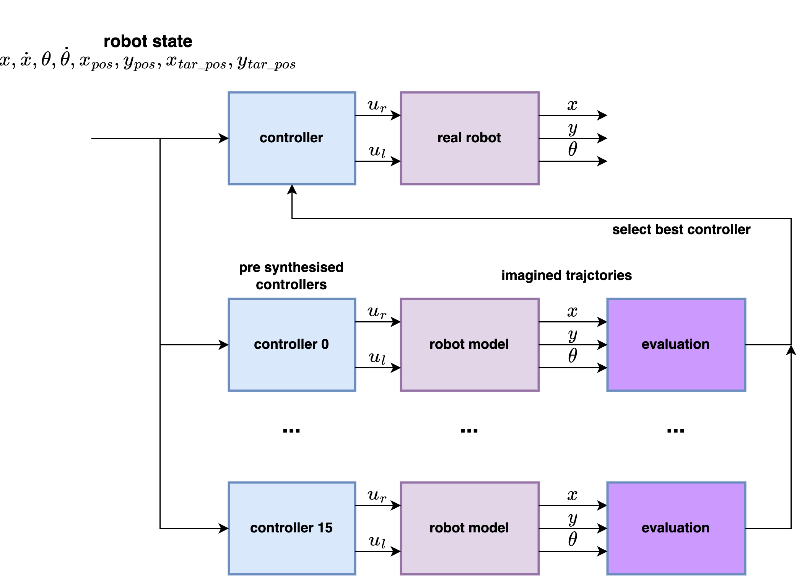

# motoko ice dragon line follower

- brushless motors
- LQG - linear quadratic regulator + Kalman filter
- LSTM for line shape prediction
- multiple local optimal LQR controllers selecting

 
# LQR controller

# meta LQR control

