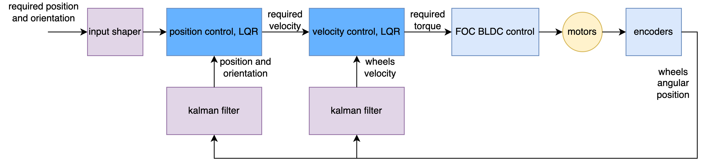
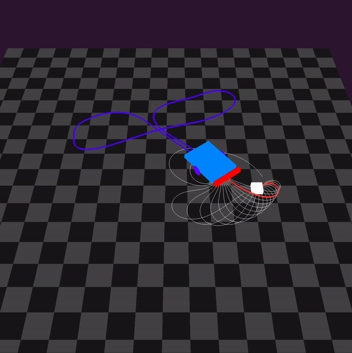

# motoko ice dragon line follower

# source structure
- [3d_print](3d_print)
- [hardware](hardware)
- [simulations](simulations)
- [firmware](firmware)

# LQR controller 

## motor velocity control
- inner loop controls brushless motors
- LQR + Kalman are used for velocity control
- runs 4kHz

## position control
- outer loop controls robot state - distance and orientation
- LQR controller is used
- state is : (distance, orientation, velocity, angular rate)
- runs 250Hz

## LQR optimal control
- basic idea is solving discrete riccati algebraic equation
- to remove distrubance, integral action term is included

## motors velocity control
step response 1st order identification

- video of identification proces : https://www.youtube.com/watch?v=B-Wuzev6Ze0
- first the max RPM is estimated, using open loop and FOC controll
- during measuring max RPM the encoder noise variance is also measured (necessary for kalman filter)
- next step is calculating motor time constant (considering 1st order model)
- c++ source [identification.cpp](firmware/usr/identification.cpp#L16)
- LQR synthesis [lqg_discrete.ipynb](simulations/motor_controller/lqg_discrete.ipynb)
- step response and disturbance rejection

- controller for brushless motors in c++ (1D LQR + kalman) :
[lqg_single.cpp](firmware/LibsDrivers/lqg_single.cpp)

- whole motor driver : 
[motor_control.cpp](firmware/LibsDrivers/motor_control.cpp)

## position controll

- kalman based identification
- LQR synthesis
- [controller identification + synthetis](simulations/robot_controller/robot_controller_a.ipynb)
- step response and disturbance rejection

# photos

- [photos](doc/images/README.md)

- brushless motors
- LQG - linear quadratic regulator + Kalman filter
- LSTM for line shape prediction
- multiple local optimal LQR controllers selecting

# software architecture

